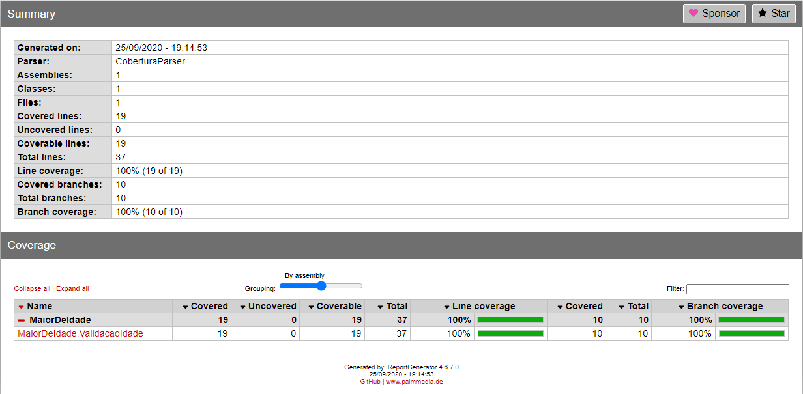
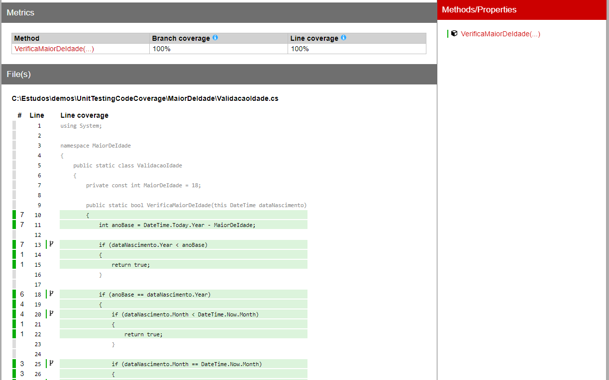

# Cobertura de testes com Coverlet e Report Generator

[](https://github.com/rodri-oliveira-dev/teste-de-cobertura/actions/workflows/ci.yml)

Este projeto aborda o uso da cobertura de código para Testes de Unidades com [Coverlet](https://github.com/coverlet-coverage/coverlet) e geração de relatórios usando o [ReportGenerator](https://github.com/danielpalme/ReportGenerator). Embora este artigo se concentre em C# e xUnit como a estrutura de teste, o MSTest e o NUnit também funcionariam. O Coverlet fornece uma estrutura de cobertura de código para C#.

Além disso, este projeto demonstra como usar as informações de cobertura coletadas durante os testes para gerar um relatório legível e aplicar um quality gate no CI.

## Execução dos Testes

Execute a solution com:

```PowerShell
dotnet test XUnit.Coverage.sln
```

## Coletar cobertura

O projeto utiliza Microsoft Testing Platform com `coverlet.MTP`. Para executar os testes e gerar cobertura no formato Cobertura:

```PowerShell
dotnet test XUnit.Coverage.sln --results-directory artifacts/test-results --coverlet --coverlet-output-format cobertura
```

O arquivo `coverage.cobertura*.xml` será gerado dentro de `artifacts/test-results`.

## Gerar relatórios

O ReportGenerator é versionado como ferramenta local do repositório. Restaure as ferramentas com:

```PowerShell
dotnet tool restore
```

Depois gere o relatório HTML:

```PowerShell
dotnet reportgenerator -reports:"artifacts/test-results/**/coverage.cobertura*.xml" -targetdir:"artifacts/coverage-report" -reporttypes:"Html;TextSummary"
```

O relatório HTML será criado em `artifacts/coverage-report`.

## Quality gate

O pipeline exige no mínimo:

- **90% de line coverage**
- **90% de branch coverage**

O próprio ReportGenerator aplica esses thresholds. Se qualquer uma das métricas ficar abaixo do mínimo, o job de CI falha.

O relatório HTML e o arquivo Cobertura são publicados pelo GitHub Actions como artifact `coverage-report`, com retenção de 7 dias.

Tela de resumo do projeto:



Tela detalhada da classe e funções:


